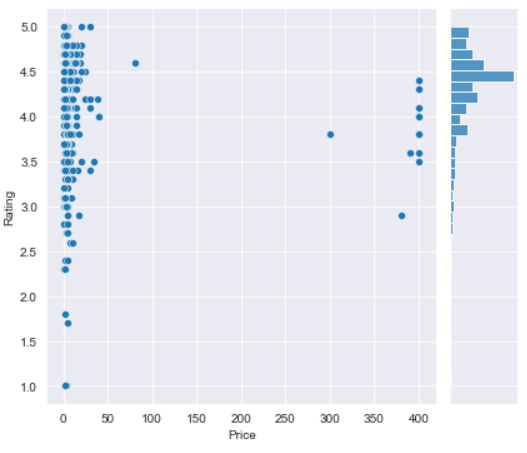

# Android App Market Analysis
Load, clean, and visualize scraped Google Play Store data to gain insights into the Android app market.

## Project Overview

Mobile apps are ubiquitous, easy to create, and offer lucrative opportunities. This project involves a comprehensive analysis of the Android app market by comparing over ten thousand apps on Google Play across different categories. The objective is to extract insights from the data to devise strategies for driving growth and retention. The dataset, scraped from the Google Play website, consists of two files: `apps.csv` containing app details and `user_reviews.csv` with sentiment-tagged user reviews.


## Key Features

1. **Data Cleaning and Import**
2. **Data Types Correction**
3. **Category Exploration**
4. **Rating Distribution Analysis**
5. **Size, Price, and Rating Relationships**
6. **Filtering "Junk" Apps**
7. **Paid vs. Free App Popularity Comparison**
8. **Sentiment Analysis of User Reviews**
9. **Data Visualization (Seaborn and Plotly)**
10. **Code Execution Instructions**
11. **Acknowledgments for External Libraries**

## Project Structure

- `datasets/`: Contains the dataset used for analysis and modeling.
- `notebook/`: Jupyter notebooks for exploratory data analysis, feature engineering, and modeling.
- `images/`: Visualizations and plots generated during the analysis.

## Getting Started

1. **Clone the Repository:**
   ```bash
   git clone https://github.com/AyazRao/The-Android-App-Market-on-Google-Play.git
   cd The-Android-App-Market-on-Google-Play

## Instructions for Running the Code

Ensure you have the required libraries installed. Run the provided code cells in sequential order.

```bash
pip install plotly
```
   
## Tasks

### Task 1: Google Play Store Apps and Reviews

Import the data, drop duplicate rows, and inspect the dataset.

### Task 2: Data Cleaning

Clean the dataset by removing special characters in the `Installs` and `Price` columns.

### Task 3: Correcting Data Types

Convert `Installs` and `Price` columns to the float data type.

### Task 4: Exploring App Categories

Analyze the distribution of apps across different categories.


### Task 5: Distribution of App Ratings

Explore the average app rating across all categories.


### Task 6: Size and Price of an App

Examine the relationship between app size, price, and ratings.




### Task 7: Relation between App Category and App Price

Analyze the pricing strategies for different app categories.


### Task 8: Filter out "Junk" Apps

Filter out potentially irrelevant or malicious apps.


### Task 9: Popularity of Paid Apps vs. Free Apps

Compare the number of installs of paid apps vs. free apps.


### Task 10: Sentiment Analysis of User Reviews

Perform sentiment analysis on user reviews for paid vs. free apps.


## Conclusion

In this notebook, we conducted a thorough analysis of over ten thousand apps from the Google Play Store. The insights gained can be valuable for making informed decisions in app development.

## Acknowledgments

This project uses the plotting libraries Seaborn and Plotly for visualizations.
